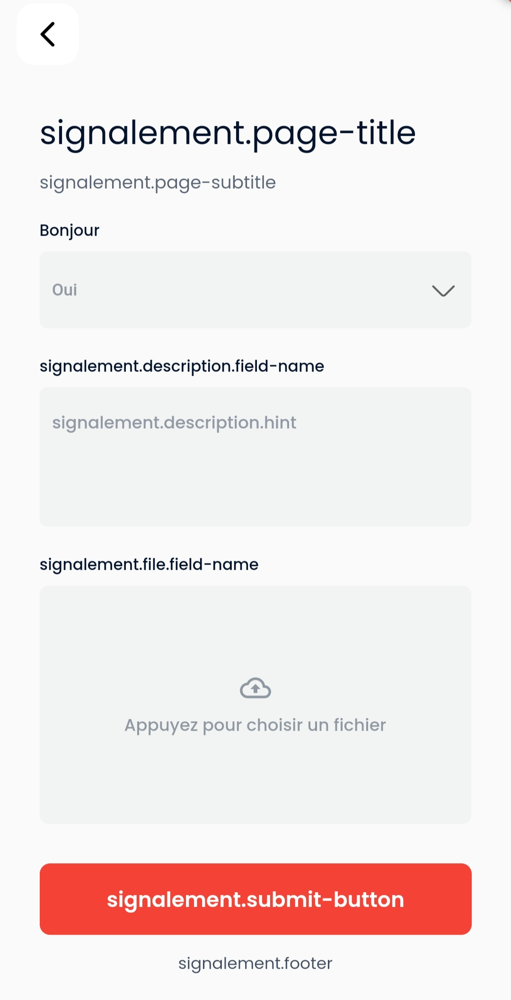
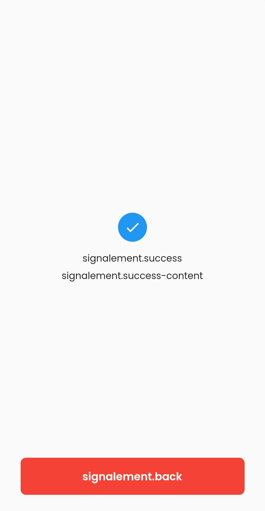

```YAML
gitlab+deploy-token-1440977
3Aypm-Few7wv8zMfgZf1
```

# signalement-package

## List translation variables

```dart
    "signalement.page-title",
    "signalement.page-subtitle",
    "signalement.description.hint",
    "signalement.description.field-name",
    "signalement.file.field-name",
    "signalement.submit-button",
    "signalement.footer",
    "signalement.success",
    "signalement.success-content",
    "signalement.back",
    
```

### ADD THIS TO YOU'RE MAIN

```dart
GetIt.instance.registerSingleton<AppTheme>(AppTheme());
final appTheme = GetIt.instance<AppTheme>();
```

### IF U WAN'T TO CHANGE SOME THEME

```dart
    appTheme.addTheme("signalement_page", SignalementThemeData();
```

## Usage

```dart
    SignalementPage(
        fieldItem: FieldModel(
            items: [
                ItemModel(child: const Text("AA"), value: "AA"),
                ItemModel(child: const Text("BB"), value: "BB",
                    childField: FieldModel(
                        items: [
                            ItemModel(child: const Text("11"), value: "11"),
                            ItemModel(child: const Text("22"), value: "22"),
                            ItemModel(child: const Text("33"), value: "33")
                        ],
                        fieldName: "Bonjour",
                        fieldHint: "Oui",
                    )
                ),
                ItemModel(child: const Text("CC"), value: "CC",
                    childField: FieldModel(
                        items: [
                            ItemModel(child: const Text("YY"), value: "YY"),
                            ItemModel(child: const Text("XX"), value: "XX"),
                            ItemModel(child: const Text("ZZ"), value: "ZZ")
                        ],
                        fieldName: "Bonjour",
                        fieldHint: "Oui",
                    )
                ),
            ],
            fieldName: "Bonjour",
            fieldHint: "Oui",
        ),
        validator: (listSelectForms, description, file) => true,
    ),
```



